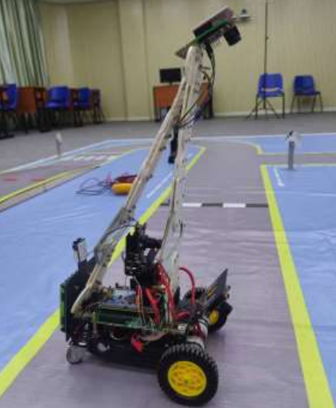
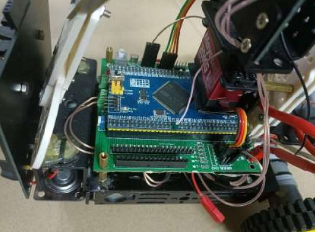
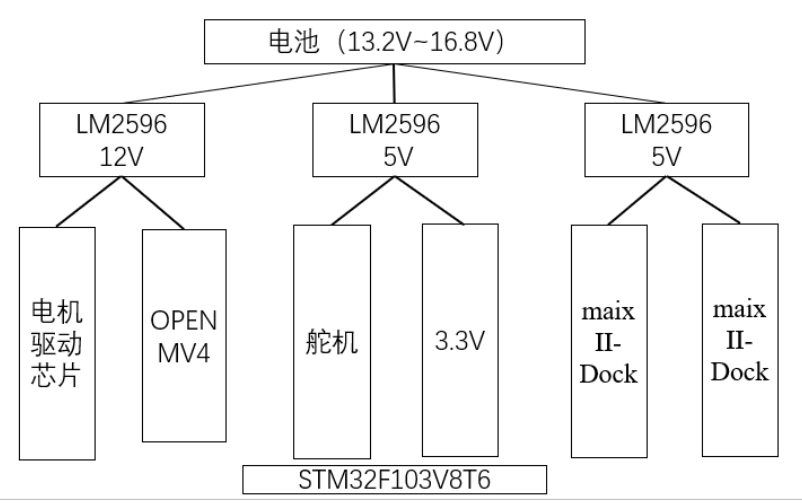
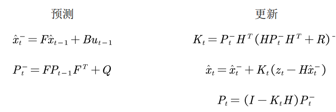

# traffic_sign_car

## 方案概述  
在本文中详细的描述了我们团队在第二十五届机器人及人工智能大赛中的
城市道路识别赛道的深度学习智能车设计方案。
根据比赛规则，参赛队伍在调试过程中可自行选择编程语言、算法、框架等，
可选择任意视觉识别训练平台进行模型训练，也可自由调节相机的摆放。因此我
们团队选择意法半导体公司的 STM32 单片机为核心控制器，对于小车行驶过程
中的循迹功能，我们团队选择了星瞳科技的 Openmv4 对赛道进行阈值处理，将
处理后的图片通过检测出的左右边线得到赛道的中线坐标通过串口发送到
STM32，然后单片机通过对接收数据的卡尔曼滤波处理，进而根据赛道中线和图
像中线的误差执行相应方向调整动作，这一过程通过 PID 算法实现，处理后得到
的值来通过差速算法实现深度学习小车在行驶过程中的转弯和调整位置的闭环
控制。
对于交通标志牌以及道路特征的处理，我们选择了 MaixII-Dock 开发板视觉
处理模块，使用 python 进行视觉方面的模型训练，要求可以达到正确识别标志
牌并实现在指定位置进行停车和减速等功能。我们在具体实现过程中选择了两个
MaixII-Dock 开发板，一个用于实现交通标志的检测，另一个用于辅助实现道路
特征的检测。
同时，为了提高小车调试的简便，使用了无线转串口模块，TFT 显示屏和上
位机调试工具等，达到了较好的人机交互效果，大大节省了调试时间，在经过了
大量的调试、测试之后，结果表明，该系统设计方案可行。

## 硬件结构设计
### 小车总体结构 
小车的主要组成部分包括核心模块和基本功能模块。
其中，核心模块包括一块循迹模块 openmv 和两块集成了 v831 芯片的 maixIIDock 模块，以及 stm32 开发板，还有电源电路、驱动板电路、舵机等，这一部
分核心模块作为深度学习小车的大脑和眼睛，例如三块带有摄像头的视觉模块，
就充当了人类眼睛的功能，而舵机则充当了人类脖子这一器官，这四个模块确保
了小车在行驶过程中遵守相应的交通规则，而 stm32 相当于人们的躯干，控制整
体小车的运动。
而基本功能模块则是诸如小车轮子以及小车整体骨架，以及用到的辅助木板，
这些基本功能结构的设计保证小车正常的行驶，例如：将 openmv 的视觉循迹模
块放在距离地面一定的高度，则需要一定数量的木板，并设计成三角形结构，保
证一定程度的结构牢固。小车的最终整体结构见下图 1
  
### 小车运动控制和单片机选型 
小车的运动的控制主要是通过从三个外接摄像头模块识别的信息通过串口传输到 stm32 核心板上，通过改变小车的默认运动状态来实现对小车运动状态的
控制。其中主控芯片和驱动板见图 2.  
  
本次设计中使用的单片机型号为 STM32F103VET6,这是一个 32 位高密性
能微控制器单元，有三个 12 位模数转换器和 4 个通用 16 位定时器，外加两个
PWM 计时器，另外有标准和先进的通讯接口，高达 2 个 IIC,3 个 SPI 和 2 个 IIS，
1 个 SDIO,5 个 USART,1 个 USB 和一个 CAN。运行频率 72MHz 高連内嵌存储
器和一个宽范围的强化输入输出外设，连接至两个 APB 总线。此 100 引脚通用
微控制器单元具有 512KB 闪存。下方是其驱动板，将 STM32 所有引脚引出，主
要用来驱动小车的两个减速电机。考虑到本次比赛为竞速类比赛，对速度有较高
的要求，同时要满足有一定的负载能力，因此我们在负载和速度之间做了一些权
衡，最终选择了减速比为 1：34 的直流减速电机。
在整个小车运行时，单片机主要作用为接收各种不同的信息——如小车循边
的中线坐标信息、图像识别标签 ID 及其坐标信息等、对收集到的数据进行处理、
对小车底层运动逻辑的控制等。  
### 循迹摄像头模块 openmv4 H7 PLUS
OpenMV 摄像头是一款小巧，低功耗，低成本的电路板，它可以很轻松的完
成机器视觉应用。可以通过高级语言 Python 脚本。Python 的高级数据结构很容易在机器视觉算法中处理复杂的输出。我们可以很容易的使用外部终端触发拍摄
或者执行算法，也可以把算法的结果用来控制 IO 引脚。
### 图像识别摄像头模块 maixII-Dock
中国的 Sipeed 开源组织在 2020 年底推出了 MaixPy3 开源软件，该产品的实物图如图 4所示。这是一款基于Linux python的Python3软件开发工具包(SDK)，
借助开源 Python 编程语言实现跨平台统一和简化 Linux 嵌入式设备上开发 AIoT 
(人工智能物联网)应用。旨在打造可落地的视觉 AI 应用生态，帮助更多人了解、
使用 AI 技术来解决实际问题，推进全球边缘 AI 的落地化进程。
而本次使用的 MAIX-II 核心模块是可运行 Linux 环境的入门级边缘计算(内
置 NPU )板卡，搭载了 MAIXII-DOCK SoC，系统移植自 OpenWrt ,OpenWRT，
是一个高度模块化、高度自动化的嵌入式 Linux 系统，拥有强大的网络组件和扩
展性，常常被用于小型机器人、智能家居等设备中。
### 驱动板电路
驱动板在本次项目中的作用是为核心板进行供电，从而实现对三个包含摄像
头模块的芯片供电，同时实现对电机转动的控制，同时引出一系列接口例如
USART、PWM 等，方便对其他功能的控制。
本次电机驱动芯片选择的是由德州仪器生产的微型电机驱动集成芯片——
L293D，最大驱动电流为 600mA，电压范围为 4.5V~36V。

### 电源电路设计
电源是电路正常工作的动力源泉，所以电源的设计对于系统来说是至关重要
的。本次使用的电池电压是 4 节 18650 电池串联,电池电源 13.2V 到 16.8V 不等，
而系统中的模块电源需求各不相同，因此需要对电源电路进行设计。
为了不损坏电池且方便调试，我们设计将电池盒与低压报警器集成在了同一
块电路板上,更加直观且美现,当电池电量不足时蜂鸣器会及时报警提醒更换电池  
如上图所示，共使用了四块 18650 锂电池，最大供电可以达到 16.8V，其中
电机驱动芯片和 OPENMV 需要 LM2596 提供 12V 供电，而舵机需要的电压一般
是 4V-6V，电压越高，响应越快，而摄像头模块都需要 5V 供电，LM2596 系列
它的输入电压和输入电流均满足需求，转换效率高，而且具有过热保护和限流保
护功能，故综合考虑后采用 LM2596-5.0 来进行降压处理。
考虑到项目中使用的两块 MaixII-Dock 工作时功耗较大，LM2596-5.0 降压
输出功率不够,故另使用一路 LM2596 -5.0 单独对两块 MaixII-Dock 进行供电。  
  
## 道路图像采集及其处理
道路图像的采集是依靠 OPENMV4 进行的，在使用其采集完数据并进行预
处理后将关键的信息通过串口传回 stm32，从而得到下一步小车的运动轨迹，而
小车在运行过程中同样需要将运行过程中的数据进行处理得到关信息传回stm32.
所以 stm32 和 OPENMV 之间的数据传输是双向的，同时还是互相影响的。  
### 图像采集及其处理 
在使用 OPENMV 采集图像之前需要对镜头的视角和范围进行确定，因为识
别和回传数据的好坏在很大程度上取决于镜头的各方面的参数，考虑到种种因素
的影响。由于在尝试了 OPENMV 的原始镜头，在转弯的时候不能将所有的道路
范围全部包含，一个合适的镜头或者说考虑到后续数据传输的质量，需要将全部
的赛道道路全部覆盖，这时就需要使用广角镜头，但可视角越大的镜头往往拍携
出来的画面畸变敦越严重，所以就需要挑选可视角合适且畸变不太明显的镜头，
在配合 OpeaMV 自带的响变修复算法可以很方便的对拍摄的图像进行畸变桥正
处理，在本次项目中我们使用的是 130 度的广角镜头。
由于我们的赛道的边缘区域是黄色，同时考虑到彩色图像数据量大，传输速
度慢，传输的数据不能及时的处理，使得小车出现功能上的延时，我们决定使用
二值化处理，将彩色图像二值化，这样处理不仅降低的数据量，同时避免了彩色
图像由于信息杂乱带来的噪声影响，提高了鲁棒性。
获取图片时，我们还需设置需要获舰的图像大小，即设置从摄像头感光元件
信号中需要的范围，可以简单理解为图像分辨率。图片越大，在进行图像处理时
需要占用的硬件资源数越多，严重则会导致图片处理速度便慢，影响小车正常运
动逻辑，在选择图像大小时，还需配合镜头可视角进行选职，尽量使画面信息足
够我们进行图像处理，算法正常运行。在权衡利弊后，最后选择了 QSIF 图像，
即分辨率 176x120 的图像格式。
在需要进行颜色判断或追踪时，应将自动增益和白平衡关闭，以防止对颜色
精确度的干扰。曝光时间是为了将光投射到照相感光材料的感光面上，快门所要
打开的时间。视照相感光材料的感光度和对感光面上的照度而定。这里我们使用
默认值即可。同时我们在获取图像时还尝试了将图像进行随机跳过几帧，以此来确保对一
些不好路况的忽略，但是由于使用效果不佳，故没有设置。
### 图像预处理
在选择了广角摄像头之后，我们在使用摄像头获取图像后，还需要对图片进
行二值化处理或者一些其他的图像处理算法，来得到感兴趣的区域，以便实现相
应的操作。
由于 openmv 平台提供的算法接口支持和实现的程度以及灵活性，我们选择
了二值化处理作为图像的预处理方法。考虑到在视觉检测中需要的不仅仅是对场
景颜色的高要求，同时需要对亮度等条件有苛刻的要求，我们选择的色彩模型为
LAB，该色彩模式在本项目中需要设置成一个元组的形式，共有 6 个数字，前两
个表示亮度的范围，中间两个代表从绿色到红色的分量，最后两个值表示从蓝色
到黄色的分量。
我们可以使用 OPENMV IDE 实现对 LAB 颜色数组的获得，我们将 openmv
镜头安装在小车上，保持镜头完整的照到赛道，然后在 IDE 中选择工具中的阈值
编辑器，在帧缓冲区中选择我们感兴趣的区域——黄色，接着在 IDE 首页的色彩
空间可以得到具体的范围，由此即可得到 LAB 数组。  
### 道路边线坐标检测与图像噪声点过滤
在获取了一张道路的二值化图像后，我们进行巡线代码的实现，道路循迹方
法一般都是获取赛道中线，再根据赛道中线来进行借迹赛道的中线又是由道路两端的边线求去平均值解出，所以我们第一步要做的便是通过扫线来获取道路两端
边线的位置信息，由于 OPENMV4 数据处理能力有限使得我们只能对整幅赛道
图像的一部分进行采集，采用隔行扫描的方法，以每 10 行为分割对图像进行打
能，扫描 12 行，最后将扫描料到的点连线得到边界线。
扫线的具体思路是:以一张二值化图像最底端的一行的中点为起始点，分别
向两端进行数组遍历，当遍历结果发生改变时，即遍历值从(0.0,0)变成(255，255，
255)就说明找到了这一行黄边线所在坐标位置，再将当前行的左右边线坐标取平
均值即当前行中线作为下一扫线行的扫线起始纵坐标。

````python
 img = sensor.snapshot().lens_corr(strength = 1.8, zoom = 1.0)
 img = sensor.snapshot().binary([gray_threshold])
 for i in range(len(Left_line_array)-1,-1,-1):
    for y in range(midcourt_line_temp,0,-2): #左边线数组判断
        Left_line_array[i] = y#记录黑色块的位置
        if img.get_pixel(y,i*10)==(0, 0, 0):#寻找纯黑色的色块
            if ((img.get_pixel(y,i*10+2)==(0, 0, 0))&(img.get_pixel(y,i*10-2)==(0, 0, 0))):
                break
    for y in range(midcourt_line_temp,width-2,2): #右边线数组判断
        Right_line_array[i] = y#记录黑色块的位置
        if img.get_pixel(y,i*10)==(0, 0, 0):#寻找纯黑色的色块
            if ((img.get_pixel(y,i*10+2)==(0, 0, 0))&(img.get_pixel(y,i*10-2)==(0, 0, 0))):
                break
 midcourt_line_temp=(Left_line_array[i]+Right_line_array[i])//2 #动态中线
````
对两端进行扫线时，还应该考虑图像噪声点对扫线精度的影响，这里我们使
用的方法是，当扫描到黑色区域时，同时检测它周围的点，当都满足黑色则为确
认发生颜色跳变。  
实现噪声点过滤的代码如下所示：  
````python
if Right_line_array[len(Left_line_array)-1] - Left_line_array[len(Left_line_array)-1] < 85: #宽度过滤
    Left_line_array[len(Left_line_array)-1] = Left_LastLocation
    Right_line_array[len(Right_line_array)-1]=ight_LastLocation
````
对其他行进行相同的操作后，我们便初步得到了两边线的大致坐标。  
### 边线坐标突变检测与线性修复
由于在车行驶的两侧赛道的中间位置，不可能两侧的赛道一直是实线，例如：
会在某些位置出现左边线或者右边线突然中断的现象（在减速之后左边会出现黄
线短暂消失的现象、环岛时出现黄虚线），这种现象都属于突变的现象，如果不
对这些突变的情况进行处理，势必会对小车的运动轨迹产生很大的影响。但是需
要注意的是突变情况的发生一定是从图像的最下方的位置发生丢线。
突变的情况除了上面的特殊赛道特殊的特征之外，也有一种可能是我们的小
车在行驶的过程中需要调整位置。我们需要根据具体的情况对发生突变的位置进
行加强操作，也就是补线的操作，在出现左边线完全消失的情况下，我们仍然要
保持原路行驶，需要对左边进行补线，具体的操作是：当检测到左边线和上一帧
的像素差值达到一个阈值时，让当前帧继承上一帧的位置信息具体的代码实现如
下：  
````python
if colour_select == 1:#代表需要加强左边线的检测
    LC = Left_LastLocation - Left_line_array[i-1]
    if LC > 20: #这里的阈值设置为20
        Left_line_array[i] = Left_LastLocation #继承上一帧位置状态
````
除了上面的情况，还可能发生小车在正常行驶过程中的突变的发生，检测是
否有丢线情况的发生，如果发生突变，则继承上一帧的位置，反之，则将当前的
位置保存，用于下一帧的判断。代码如下：  
````python
if Left_line_array[i] <= 10: #有丢线
    Left_line_array[i] = Left_LastLocation #继承上一帧位置状态
    continue
elif Left_line_array[i] > 10: #没有丢线
    Left_LastLocation = Left_line_array[i] #位置状态保存，为下一帧做参考
````
接下来是左、右边线数组突变的检测与处理。
左边线：
突变的发生还需要考虑到的情况是突然发生急转弯或者转弯比较大的情况，
假如我们以急转弯作为一种典型的情况来讨论，那么可能向左急转弯，也可能向
右急转弯，这就需要我们在发生突变的时候进行判断，同时设置突变的方向和是
否发生突变，为即将到来的突变情况做出预防，以上是在暂时没有检测到时，如果当前位置已经检测到突变，则需要检测第二次，如果发现正负突变有恢复的迹
象，也就是马上会回到原来的轨迹上，则继续检查是否出现过度回复的情况发生，
如果发生，需要更改突变的方向，否则需要恢复突变，负突变和正突变同理，需
要计算突变的个数，然后逐步通过补线的方法恢复赛道的轮廓（也就是左右数组），
进而确定中线，使得小车及时纠正自己的位置行驶，同时恢复突变标志位。最后
还需要考虑一种情况，找不到第二个突变点，则需要在第一个突变点向上补线。
正突变的操作和负突变的操作一致。  
````python
if saltation_flag == 0: #没有突变或突变已补全
    if Left_line_array[i] - Left_line_array[i+1] > 10:#数组发生正突变
        GaugePoint_1 = i+1
        saltation_flag = 1 #突变标志位改变
        saltation_direction_flag = 1 #突变方向记录
    if Left_line_array[i] - Left_line_array[i+1] < -10:#数组发生负突变
        GaugePoint_1 = i+1
        saltation_flag = 1 #突变标志位改变
        saltation_direction_flag = -1 #突变方向记录
else: #存在突变，检测第二次突变点
    if Left_line_array[i] - Left_line_array[i+1] > 17:
        if saltation_direction_flag == -1:#负突变恢复
            if Left_line_array[i] - Left_line_array[GaugePoint_1] >25: #突变恢复距离过长，负突变转正突变
                saltation_direction_flag = 1 #突变方向标志改变
            else:
                GaugePoint_2 = i
                #突变数据处理-------
                saltation_Num = GaugePoint_1-GaugePoint_2#计算突变个数
                if saltation_Num == 0:
                    break
                saltation_interval = (Left_line_array[GaugePoint_1] - Left_line_array[GaugePoint_2]) // saltation_Num #计算突变补全间距
                for y in range(1,GaugePoint_1 - GaugePoint_2, 1):
                    Left_line_array[GaugePoint_1 - y] = Left_line_array[GaugePoint_1] - saltation_interval * y
                saltation_flag = 0 #突变标志位恢复
    if Left_line_array[i] - Left_line_array[i+1] < -17:
        if saltation_direction_flag == 1:#正突变恢复处理
        if Left_line_array[i] - Left_line_array[GaugePoint_1] < -25: #突变恢复距离过长，正突变转负突变
            saltation_direction_flag = -1 #突变方向标志改变
        else:
            GaugePoint_2 = i
 #突变数据处理-------
            saltation_Num = GaugePoint_1-GaugePoint_2#计算突变个数
            if saltation_Num == 0:
                break
                saltation_interval = (Left_line_array[GaugePoint_1] - Left_line_array[GaugePoint_2]) // saltation_Num #计算突变补全间距
            for y in range(1,GaugePoint_1 - GaugePoint_2, 1):
                Left_line_array[GaugePoint_1 - y] = Left_line_array[GaugePoint_1] - saltation_interval * y
            saltation_flag = 0 #突变标志位恢复
    if i == 0: #如果找不到第二个突变点，则第一个突变点向正上补线
    for y in range(1,GaugePoint_1+1, 1):
        Left_line_array[GaugePoint_1 - y] =  Left_line_array[GaugePoint_1]
    saltation_flag = 0 #突变状态标志清零
    saltation_direction_flag = 0 #突变方向标志清零
````
右边线的处理和左边线基本相同。  
### 赛道特殊元素处理
#### 弯道
弯道在本赛道中可以分为小弯道、直角弯道和大弯道，弯道的处理设计到许
多方面的因素，包括突变检测处理算法中对于像素突变容忍度的设置，还有 PID
算法中的系数设置等等。
对于小弯道，直角弯道和大弯道我们通过单独的调试，包括针对突变容忍区
间的更改以及 PD 参数的更改，最终都可以实现完整的转弯。
#### 环岛
在环岛处的转弯时调试过程中发生了冲出赛道的情况，可能是由于速度过快
导致，故考虑在进入环岛后，将速度降低，实现在环岛内的正常识别。
#### 岔路路口
岔路路口的实现主要是依靠对左边线的加强操作，在发现左边线丢失之后，对左边线的检测并不会全部是 0 值，而是会根据上一帧的位置继承到这一帧，直
到不需要补线为止，这样可以保证在通过岔路路口时，不会收到影响。
#### T 型路口
T 型路口在红绿灯路段出现，在信号灯由红灯变为绿灯时，小车需要及时识
别路况，向左转，最终抵达终点线。但是由于我们在程序中添加了加强左补线的
命令，现在需要取消左补线，需要通过串口向 OPENMV 发送取消左补线的命令，
在左侧没有补线，而右侧补线的情况下，小车会趋向右行驶，最终到达终点。
## 交通标志图像识别
在保证小车正常行驶的同时还需要使小车遵守交通规则，这时就需要目标检
测相关的内容，在检测到对应位置的标志牌或者道路特征时，需要执行相应的操
作。我们选择了yolo目标检测算法，主要看重其速度快的优点。主要存在的交通标志以及道路特征包括：人行横道、上坡、减速、恢复速度、
左转、上坡红虚线、环岛黄虚线。针对以上的分类数据作为标签，拍摄图像，制
作图像目标检测数据集，并进行手动标注，使用在线平台进行训练和部署在开发
板，最终实现标签信息的回传，以便 stm32 根据回传数据进行小车运动状态的调
整。
## 小车运动行为逻辑控制
### Openmv4 道路中线回传坐标数据处理 
在道路图像采集那一小节中提到，通过 Openmv4 采集的图片会将每一帧的
图片的中线坐标传输到 stm32，这个坐标将会指引小车及时调整自己的位置，而
不会压到黄线。这个过程包含了对于回传坐标的卡尔曼滤波处理。以及将误差和
左右轮的速度关联起来的 PD 算法。
#### 卡尔曼滤波
卡尔曼滤波（Kalman filtering）是一种利用线性系统状态方程，通过系统输
入输出观测数据，对系统状态进行最优估计的算法。由于观测数据中包括系统中
的噪声和干扰的影响，所以最优估计也可看作是滤波过程。
用通俗的话来说就是，以我们的小车行驶状态举例，小车在行驶的过程中一
方面会收到 Openmv 传回来的坐标信息，同时还有小车实际所处的位置，也就是
一个预测值，一个测量值，更应该相信哪一个的问题，卡尔曼滤波提供的一种思
想是两种分别有一个概率，将概率作为权重，分别分配到两个值上，最后得到一
个权衡的值。这种做法的好处是，我们可以在程序中手动通过调整参数的方法控
制更相信预测值还是测量值。
具体实现可以使用下列公式表示  
  
在实际应用到我们的小车，由于传输的数据是一维的， 可以设置H、I、F
为 1，根据上述公式，我们可以编写如下所示的卡尔曼滤波代码  
````
//卡尔曼滤波变量
float P=1;
float P_; //对应公式中的p'
float X=0;
float X_; //X'
float K=0;
float Q=0.01;
float R=0.0000001; //越小越相信测量值0.1
float kalman_filter(float Actual_Coord)//卡尔曼滤波
{//预测
X_ = X + 0;
 P_ = P + Q;
 //更新
 K = P_ / (P_ + R);
 X = X_ + K * (Actual_Coord - X_);
 P = P_ - K * P_;
 return X;
}
````
由预测和更新的公式构成了卡尔曼滤波的主体函数，Q 和 R 作为超参数，值
可以动态调整，最后将滤波后的值返回。  
#### 位置型 PD 算法
PD 算法是 PID 算法去掉积分系数后，只使用比例系数（P）和微分系数（D）
的控制算法，顾名思义，PID 控制算法是结合比例、积分和微分三种环节于一体
的控制算法，它是连续系统中技术最为成熟、应用最为广泛的一种控制算法。总
而言之，PID 控制的实质就是根据输入的偏差值，按照比例、积分、微分的函数
关系进行运算，运算结果用以控制输出。  
实现代码如下：  
````
float Aim_Coord=88; //设定坐标
float Actual_Coord=0; //小车的位置实际值
float Err_Coord; //当前误差
float Err_Coord_Last=0; //上次误差
float Integral_Coord=0; //积分值
float Dutycycle_Temp = 0;
float Car_P=2.35;//1.32 2.38
float Car_D=9.1;//6.8 9.5
void Car_PID_realize()//PD控制
{
Actual_Coord = kalman_filter(CarData[2]*1.0);
Err_Coord = Actual_Coord - Aim_Coord;//中线坐标减图像中心坐标（88）
Dutycycle_Temp = (Car_P*Err_Coord) + (Car_D*(Err_Coord -
Err_Coord_Last));//根据PD算法处理后的值来设置左右轮子的速度
Err_Coord_Last = Err_Coord;
if(Dutycycle_Temp>70) //输出阈值限制
Dutycycle_Temp=70;
if(Dutycycle_Temp<-70)
Dutycycle_Temp=-70;
if(Dutycycle_Temp>0)
{
Left_Speed_duty =Car_Speed_Control + Dutycycle_Temp;
Right_Speed_duty =Car_Speed_Control - Dutycycle_Temp;
}
else
{
Left_Speed_duty =Car_Speed_Control + Dutycycle_Temp;
Right_Speed_duty =Car_Speed_Control - Dutycycle_Temp;
}
if(Left_Speed_duty<15)
{
Left_Speed_duty = 15;
}
if(Right_Speed_duty<15)
{
Right_Speed_duty = 15;
}
}
````
如上述代码所示，首先设置 P 和 D 的值，然后根据小车的测量值经过卡尔
曼滤波，将滤波处理后的值和实际值之间的差作为误差，我们显然需要最小化这
个误差，同时我们还需要设置上一次误差的值来保存当前误差，然后利用 PID 算
法公式计算出的值来控制左右轮的速度。为了防止误差过大时的干扰，对其进行
阈值限制，同时设置左右轮的最小速度，在发生误差时左右轮的相对速度变化来
实现小车在黄线赛道变化时的位置控制.  
### MaixII-Dock 物体识别数据处理 
在通电之后，小车的电机将一直处于工作状态，但是小车对速度的控制将由
Openmv 实现，从而进行转弯，误差纠正等。而对于道路标志牌以及红绿灯的做
出相应的动作将由 MaixII-Dock 识别后通过串口传输到 stm32 核心板，根据传回
的标签和标志所在的位置对小车的运动状态进行控制。
#### 通信格式设计
其中，需要传输的数据有交通标志的标签和位置信息，选择这两个信息作为
数据位，同时设置起始位和结束位，通过 MaixII-Dock 的串口发送数据，代码如
下：  
````
send_data =
bytearray([0xb3,0xb4,int(labels[class_id],10),box[0],0x5b])
ser.write(send_data)
````
数组的第三位和第四位代表了交通标志的标签和位置。两块 MaixII-Dock 的
通信格式一致。  
#### 状态机设计
在 stm32 成功接收到 MaixII-Dock 传输来的数据时需要根据标签对小车的运
动状态进行控制，根据接收到的标签，利用分支结构语句，使得不同的标志对应
不同的状态处理函数。状态机设计的代码如下所示：  
````
void Car_State_Decision(void)
{
switch(Car_State_flag)
{
case 0: Car_State0(); break;//默认状态
case 1: Car_State1(); break;//识别到人行道标志
case 2: Car_State2(); break;//识别到坡道标志
case 3: Car_State3(); break;//识别到减速标志
case 4: Car_State4(); break;//识别到取消减速标志
case 5: Car_State5(); break;//识别到左拐标志
case 6: Car_State6(); break;//识别到红灯
case 7: Car_State7(); break;//识别到绿灯
case 11: Car_State11(); break;//识别到红虚线
case 12: Car_State12(); break;//识别到环岛黄虚线
}
Car_LastState_flag = Car_State_flag;
}
````
## 总结
按照上面我们的设计方案，使用 OpenMV 进行道路的循迹，保证小车在赛
道内正常的行驶，而两个 maixII-Dock，一个用于识别交通道路的标志，另一个
用于识别道路的特征，使用 STM32 核心板接收 maixII-Dock 传来的交通信息，
控制电机做出相应的动作，而和 OpenMV 的交互是双向的，既需要接收道路的
信息控制小车的运动速度和方向，又需要传送小车的位置信息。
最终，我们的小车从起点出发，在人行横道处实现了 1s 钟左右的停车，然
后在坡道的指定区域实现了停车，在识别到减速指示牌之后降速，接着在识别到
取消减速时恢复原始速度，最后通过环岛等一系列特殊赛道元素后，在红灯时实
现了停车，在接收到绿灯信号后出发，左转到达终点。实现了 44 秒的总时长，
没有出现压线等错误，表现良好。
